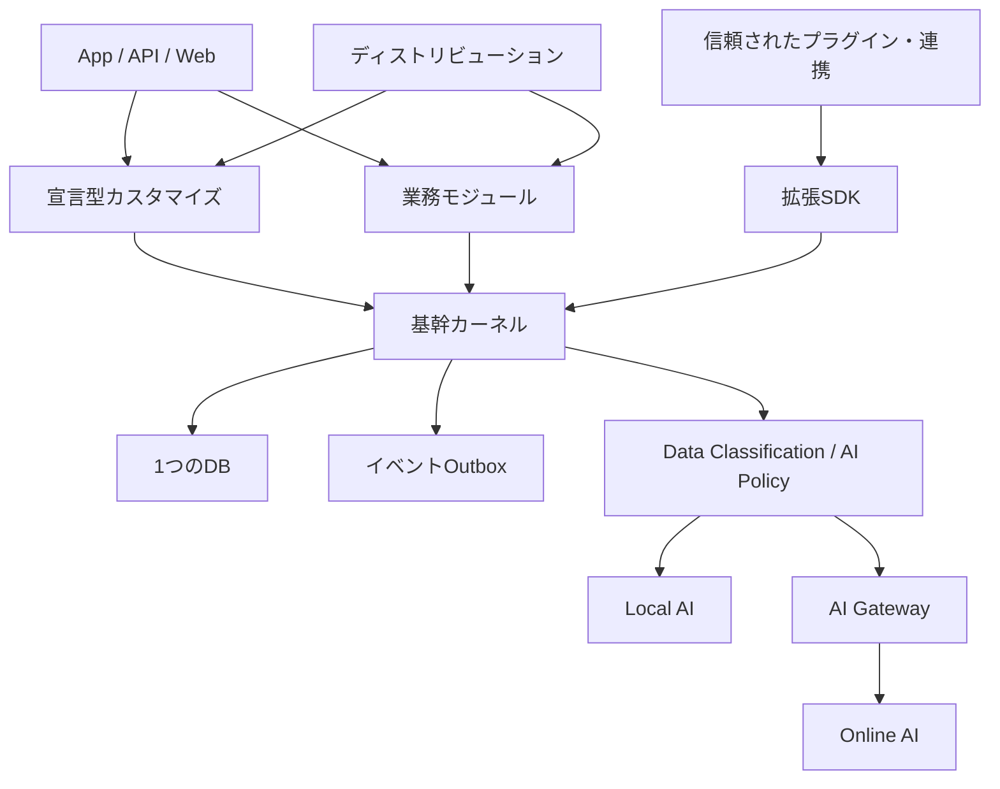
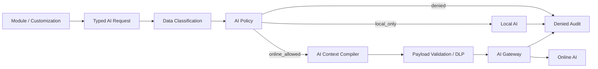

# open-hoikuict Kernel Lab 基幹カーネル・拡張アーキテクチャ仕様書

- 対象リポジトリ: `open-hoikuict-kernel-lab`
- Upstream: `hoikuict/open-hoikuict`
- 文書種別: 上位アーキテクチャ仕様 / 拡張基盤仕様
- ステータス: Draft
- 作成日: 2026-07-20
- 想定読者: コア開発者、モジュール開発者、導入・運用責任者、AIカスタマイザー開発者
- 関連文書: `security.md`、`operations.md`、`integration-contract.md`、`facility-settings-spec.md`

---

## 1. 目的

open-hoikuictは、完成済みの一枚岩の保育ICTを園ごとに複製して配布するのではなく、保育業務に共通する安全な基盤をOSSとして提供する。

園・法人・自治体ごとの差異は、本体のフォークやコアコードへの条件分岐ではなく、次の組み合わせで表現する。

```text
open-hoikuict Core のバージョン
  + 有効化する業務モジュール
  + ディストリビューション
  + 園固有の宣言型設定
  + 信頼された連携・コード拡張
  + テーマ
= その園で稼働する保育ICT
```

本仕様は、この構想を実装可能かつ検証可能にするため、以下を定める。

- 基幹カーネルに含める責務と含めない責務
- モジュール、宣言型カスタマイズ、コード拡張の境界
- 安定API、ドメインイベント、データ拡張の契約
- AIが安全な変更セットを生成・検証・適用する手順
- バージョン互換性、監査、ロールバック、LTSの原則
- 現行コードから目標構造へ移行する段階

### 1.1 プロジェクト宣言

> 共通部分は人間が堅く作り、違いはAIが安全に組み立てる。

AIの能力が向上しても、認証、認可、施設境界、監査、データ整合性、適用承認、ロールバックをAIの正しさへ依存させない。

さらに、実在する園児、家庭、保護者、職員の個人情報・健康情報を、外部のオンラインAIへ送信しない。AIへ渡すのは原則として構造、契約、業務ルール、完全な合成データであり、この制約は利便性や施設設定によって緩和できないカーネル不変条件とする。

### 1.2 最重要成功指標

園固有の要件を実現するために、open-hoikuict本体をフォークする必要がないこと。

次を継続的に計測する。

| 指標 | 目標 |
| --- | --- |
| 園固有変更のうち、コア変更なしで実現できる割合 | 90%以上を目標とし、段階的に引き上げる |
| カスタマイズ適用後に本体を更新できる割合 | サポート対象構成では100% |
| 本番変更のうち、変更セット・承認者・ロールバック方法を追跡できる割合 | 100% |
| コアに追加された園・自治体固有の条件分岐 | 0件 |
| DBを直接操作する外部プラグイン | 0件 |
| 外部オンラインAIへ送信された`personal`以上のデータ | 0件 |
| AI Gatewayを迂回する外部AI通信経路 | 0件 |

---

## 2. 用語

| 用語 | 定義 |
| --- | --- |
| Core / 基幹カーネル | 全施設で守る主体、関係、認証、認可、施設境界、監査、整合性、データ分類、AI送信境界、イベント、拡張実行規則 |
| 業務モジュール | 登降園、連絡帳、健康、請求など、明確な業務能力を提供する交換可能な単位 |
| 宣言型カスタマイズ | 許可されたスキーマ内で、項目、表示、検証、権限、承認、通知などを記述する設定 |
| コード拡張 / プラグイン | 宣言だけでは表現できない処理を、制限されたSDKを介して追加する署名・審査対象パッケージ |
| 連携アダプター | メール、決済、外部認証、自治体帳票など、外部システムとの変換・通信を担当するコード拡張 |
| ディストリビューション | モジュール、ポリシーパック、既定設定、テーマ、連携の組み合わせを固定した再現可能な構成セット |
| ポリシーパック | 法人・施設種別・自治体などに共通する検証規則や設定の集合 |
| 変更セット | 設定差分、影響分析、移行、テスト、承認、ロールバック情報をまとめた適用単位 |
| actor | 人間、サービス、端末、AI支援処理を含む操作主体 |
| tenant / facility | データと権限を分離する施設境界。法人配下に複数施設を持ちうる |
| Online AI | 施設が管理する信頼境界の外側で稼働し、ネットワーク経由で利用する外部AIサービス |
| Local AI | 施設または運用主体が管理する信頼境界内で稼働し、許可されたデータを外部送信せず処理するAI |
| data classification | フィールド、値、派生物へ付与する機微度。AI送信可否、ログ、出力、保持の判定に用いる |
| AI Gateway | Online AIへの唯一の接続口。分類、目的、送信先、payloadを検証し、許可された要求だけを送信する境界サービス |
| LTS | セキュリティ修正と互換性維持を長期提供する安定系列 |

本仕様で「必須」と記載した要件は、実装時に満たさなければならない。「推奨」は、採用しない合理的理由をADRへ残す。

---

## 3. 設計原則

### 3.1 不変条件

以下は、モジュール、設定、プラグイン、AI生成物によって無効化できない。

1. 操作主体が識別されていること
2. 対象施設が一意に決まり、施設境界を越えないこと
3. 対象データへの権限がサーバー側で検証されること
4. 重要操作の監査証跡が残ること
5. トランザクション途中の不完全な状態を確定しないこと
6. 保持義務・承認済み・請求確定済み等の保護対象記録を物理削除しないこと
7. すべての適用済み変更を構成とバージョンから再現できること
8. 本番変更に人間の明示承認とロールバック手段があること
9. 実在する個人情報、健康情報、秘密情報をOnline AIへ送信しないこと
10. 未分類データと自由記述を安全と推定せず、Online AI送信を既定拒否すること
11. Online AI通信をAI Gatewayへ集約し、モジュール、プラグイン、AI生成コードによる迂回を許さないこと
12. 加工、要約、仮名化によってデータ分類を自動的に引き下げないこと

### 3.2 依存方向



依存規則は次のとおりとする。

- カーネルは、特定の業務モジュール、園、法人、自治体、外部サービスへ依存してはならない。
- 業務モジュールはカーネルの公開サービスを利用してよいが、他モジュールのテーブルを直接参照・更新してはならない。
- モジュール間連携は、公開サービスまたはバージョン付きドメインイベントを使用する。
- プラグインはORMモデル、DB接続、内部ルーターを直接利用してはならない。
- 画面側の非表示だけを権限判定としてはならない。認可は必ずサーバー側で再評価する。
- モジュール、プラグイン、Web画面はOnline AI SDKや外部AI endpointを直接呼び出してはならない。
- Online AIの認証情報はAI Gatewayだけが保持し、アプリ本体とプラグインへ渡してはならない。

### 3.3 初期配置方式

当面は次を標準とする。

- 1つのFastAPIアプリ
- 1つのデプロイ単位
- 1つのDB
- 内部境界を明確にしたモジュラーモノリス

マイクロサービス化は本仕様の前提ではない。運用負荷、分散トランザクション、監査の複雑化を正当化できる場合のみ、別ADRで判断する。

---

## 4. スコープ

### 4.1 本仕様の対象

- 法人・施設・園児・家庭・保護者・職員・クラス・所属関係の基礎モデル
- 職員・保護者・端末・サービスの認証主体
- ロール、関係、属性を組み合わせた認可
- 施設分離と施設コンテキスト
- 監査ログ、変更履歴、データライフサイクル
- フィールド単位のデータ分類、分類継承、AI送信ポリシー
- Local AI / Online AIの信頼境界とAI Gateway
- ドメインサービス、公開API、イベント契約
- 宣言型項目、画面、検証、権限、承認、通知、帳票の拡張
- コード拡張SDKと互換性規則
- ディストリビューションの構成形式
- AIによる要件解析、変更案作成、検証、プレビュー、承認支援
- 変更の適用、観測、ロールバック

### 4.2 本仕様の対象外

- 各業務モジュール固有の詳細画面・帳票仕様
- 自治体ごとの具体的帳票項目
- 特定AIモデルまたはAIベンダーの選定
- クラウド、オンプレミス等の単一配備方式への固定
- 法令適合性の最終判断
- AIによる保育・医療・安全判断の自動確定

---

## 5. レイヤーと責務

### 5.1 基幹カーネル

カーネルへ含めるのは、施設が変わっても意味と安全性を維持すべきものに限る。

| 領域 | 必須責務 |
| --- | --- |
| identity | actorの識別、セッション、認証方式の抽象化、アカウント状態 |
| tenancy | 法人・施設コンテキスト、所属、施設境界の強制 |
| authorization | 権限評価、関係ベースの対象範囲、ポリシー判定、deny優先 |
| subjects | 園児、家庭、保護者、職員、クラス、所属・関係の正規モデル |
| audit | 重要操作、変更前後、承認、AI利用、拡張実行の追跡 |
| data_classification | フィールド、値、添付、自由記述、派生物の機微度と分類継承 |
| ai_policy | 利用目的、実行領域、データ分類、送信先に基づく許可・拒否判定 |
| ai_gateway | Online AIへの唯一の送信口、payload検査、DLP、送信監査、provider抽象化 |
| transactions | 原子的更新、冪等性、同時更新制御、整合性制約 |
| events | イベント定義、Outbox、再送、重複排除、バージョン管理 |
| extensions | スキーマレジストリ、設定検証、互換性、適用状態 |
| workflows | 承認状態遷移の共通実行器。個別フロー定義は拡張層に置く |
| lifecycle | 論理削除、保持、アーカイブ、匿名化、エクスポート |
| time | 保存時刻、業務日、施設タイムゾーンの共通規約 |

### 5.2 業務モジュール

初期の標準モジュール候補は次のとおりとする。

- `children`
- `families`
- `attendance`
- `daily_contacts`
- `health`
- `notices`
- `staff_rooms`
- `calendar`
- `surveys`
- `extended_care`
- `billing`
- `plan_docs`

各モジュールは最低限、次を宣言する。

- モジュールIDとバージョン
- 対応Coreバージョン範囲
- 依存するモジュールと機能
- 提供するサービス、API、イベント
- 購読するイベント
- 必要権限
- 所有するデータと保持区分
- DB変更
- 有効化・無効化条件
- 契約テスト

### 5.3 拡張層へ置くもの

次は原則としてカーネルへハードコードしない。

- 園独自の入力項目、呼称、並び順
- 年齢・クラス・施設種別別の表示条件と必須条件
- 園ごとの承認フローと通知先
- 自治体固有のCSV、Excel、帳票レイアウト
- 施設固有の料金・計算ルール
- 外部サービスとの接続
- テーマと視覚表現

コアへ `if municipality == ...`、`if facility_id == ...` のような分岐を追加することは禁止する。複数施設に共通化できる要件はポリシーパックまたは標準モジュールとして提案する。

---

## 6. 基礎ドメインモデル

### 6.1 安定主体

少なくとも次の主体・関係を型付きの正規モデルとして保持する。

| 主体 | 主な関係 |
| --- | --- |
| Organization | 1つ以上のFacilityを所有・運営する |
| Facility | Organizationに属し、タイムゾーンと運用境界を持つ |
| Child | Facilityに在籍履歴を持つ |
| Family | 1人以上のChildおよびGuardianと関係する |
| Guardian | Family / Childとの法的・運用上の関係を持つ |
| Staff | Organization / Facilityへの所属履歴と職務を持つ |
| Classroom | Facilityに属し、期間付きのChild / Staff所属を持つ |

氏名や現在クラスだけで関係を表現してはならない。安定IDと有効期間を使用する。

### 6.2 識別子

- 新規の公開識別子はUUID等の推測困難な安定IDとする。
- DB内部IDと外部公開IDを分離できる構造にする。
- 表示名を参照整合性や認可判定に使用してはならない。
- API、イベント、監査ログでは施設IDを明示する。
- 既存の整数IDは直ちに全置換せず、公開ID追加と互換aliasを経て移行する。

### 6.3 在籍・所属のライフサイクル

- 在園、退園、卒園、休園、転園を履歴として保持する。
- 職員の入職、異動、休職、退職を履歴として保持する。
- 退園・退職によるアクセス停止は、データ削除とは別の操作とする。
- 過去記録のactor表示を維持するため、アカウント停止後も監査参照用の安定IDと当時表示名を保持する。

---

## 7. 認証・認可・施設境界

### 7.1 actorコンテキスト

すべての保護対象操作は、カーネルが検証済みの次のコンテキストを受け取る。

```json
{
  "actor_id": "staff:uuid",
  "actor_type": "staff",
  "organization_id": "org:uuid",
  "facility_id": "facility:uuid",
  "roles": ["classroom_staff"],
  "classroom_ids": ["classroom:uuid"],
  "auth_strength": "password",
  "session_id": "session:uuid"
}
```

クライアントから送られた`facility_id`、role、対象園児IDを無条件に信用してはならない。サーバー上のセッションと所属関係から再構築する。

### 7.2 認可モデル

認可は、単純な3ロールだけに固定せず、次を組み合わせる。

- RBAC: 管理者、主任、担任、看護師、事務、閲覧専用、保護者等
- ReBAC: 保護者と園児、担任とクラス、職員と施設等の関係
- ABAC: 記録区分、機微度、承認状態、所属期間、利用端末等

判定例:

```text
allow = actorが有効
    AND actorが対象施設に所属
    AND actionに必要な権限を保有
    AND 対象園児が担当クラス内、または管理権限あり
    AND 記録の状態がactionを許可
    AND 明示的denyポリシーに該当しない
```

ポリシー競合時は`deny`を優先する。拡張はCoreのdenyを上書きできない。

### 7.3 施設分離

- 施設所有データは原則として`facility_id`を持つ。
- 参照・更新サービスはactorの施設と対象データの施設一致を必須検証する。
- 複合一意制約には必要に応じて`facility_id`を含める。
- 管理レポート等で法人横断参照が必要な場合は、専用権限、専用サービス、監査を要求する。
- 自動テストでは、異なる2施設のデータを同時に作成し、越境不能を検証する。

現行の「1デプロイ = 1施設」運用中も、サービス境界は将来の施設ID導入を妨げない設計にする。

---

## 8. 監査・履歴・データライフサイクル

### 8.1 監査イベント

重要操作は、業務トランザクションと同じ確定単位で監査レコードを作成する。

必須項目:

| field | 内容 |
| --- | --- |
| audit_id | 一意な監査ID |
| occurred_at | UTCの発生時刻 |
| business_date | 施設タイムゾーン上の業務日。必要な操作のみ |
| actor_id / actor_type | 操作主体 |
| facility_id | 対象施設 |
| action | 作成、参照、変更、削除、承認、権限変更、出力等 |
| resource_type / resource_id | 対象 |
| before / after | 許可された変更前後の差分 |
| reason | 理由。高リスク操作では必須 |
| request_id / deployment_id | 要求・変更セットとの相関ID |
| source | web、api、import、plugin、ai_assisted等 |
| result | success、denied、failed |

パスワード、秘密鍵、認証トークン、不要な健康情報本文は監査ログへ保存しない。差分は機微度に応じてマスクする。

### 8.2 変更不能性

- 監査レコードはアプリ通常権限で更新・削除できない。
- 監査ログの閲覧自体も監査対象とする。
- 将来の改ざん検知として、連鎖ハッシュまたは外部WORM保管を選択可能にする。

### 8.3 削除と保持

- 削除は`request -> authorize -> dependency check -> soft delete/anonymize -> audit`の順で行う。
- 承認済み文書、確定請求、法定・運用保持期間内の記録は通常削除から保護する。
- 拡張フィールドにも機微度、保持期間、エクスポート可否、削除方式を定義する。
- バックアップからの復元後も、削除・匿名化要求を再適用できる台帳を持つ。

---

## 9. データ整合性とトランザクション

### 9.1 必須規則

- 同一施設・同一園児・同一業務日で許容しない重複をDB制約でも防ぐ。
- 外部キーとサービスレベル検証を併用する。
- 複数更新は原子的トランザクションで実行する。
- 外部通知はDBトランザクション内で直接送信せず、Outbox確定後に処理する。
- 再送されうるAPI・イベント処理は冪等性キーを受け付ける。
- 競合しうる更新は楽観ロック用バージョンまたは同等の仕組みを持つ。

### 9.2 時刻規約

- 永続化する瞬間はUTCのタイムゾーン付き日時とする。
- 締め日、登降園日、帳票対象日はFacilityのタイムゾーンから求めた`business_date`を明示する。
- 夏時間やタイムゾーン変更があっても、既存記録の意味が変わらないよう当時のoffsetまたはtimezoneを保持できる構造にする。
- 日付なしの園内時刻は、型と検証規則を通して扱う。

---

## 10. 安定サービスAPI

### 10.1 原則

モジュール、プラグイン、AI生成コードはDBテーブルではなく、ユースケース単位のサービスを使用する。

例:

```python
get_child(child_id, actor)
update_child_profile(child_id, changes, actor, expected_version)
record_attendance(child_id, attendance_event, actor, idempotency_key)
publish_notice(notice_id, actor)
evaluate_permission(actor, action, resource)
```

サービスは次を一括して担う。

- actor・施設境界・権限の検証
- 入力スキーマと業務ルールの検証
- トランザクション
- 監査
- イベント生成
- エラーの安定コード化

### 10.2 APIバージョン

- 外部・拡張向けAPIは`/api/v1/...`のようにmajor versionを明示する。
- フィールド追加は原則として後方互換とする。
- 意味変更、削除、型変更には新major versionと移行期間を設ける。
- 非推奨化には、代替、終了予定版、移行方法を公開する。
- 内部Python importは安定拡張契約とみなさない。SDKで公開した名前だけを契約とする。

---

## 11. ドメインイベント

### 11.1 イベント包絡形式

```json
{
  "event_id": "evt:uuid",
  "event_type": "attendance.checked_in",
  "event_version": 1,
  "occurred_at": "2026-07-19T23:12:00Z",
  "facility_id": "facility:uuid",
  "actor_id": "staff:uuid",
  "correlation_id": "req:uuid",
  "causation_id": null,
  "subject": {
    "type": "child",
    "id": "child:uuid"
  },
  "data": {
    "business_date": "2026-07-20",
    "checked_in_at": "2026-07-20T08:12:00+09:00"
  }
}
```

### 11.2 初期イベント候補

- `child.created`
- `child.updated`
- `child.enrollment_changed`
- `guardian.relationship_changed`
- `attendance.checked_in`
- `attendance.checked_out`
- `daily_contact.submitted`
- `health.alert_changed`
- `notice.published`
- `staff.permission_changed`
- `customization.deployed`
- `customization.rolled_back`

### 11.3 配信保証

- 業務データとOutboxレコードを同一トランザクションで確定する。
- 配信はat-least-onceを基本とし、購読側は`event_id`で重複排除する。
- 順序が必要な処理は`facility_id + subject.id`等の順序キーを明示する。
- 失敗イベントは再試行後に隔離し、運用者へ通知する。
- 個人情報は購読者が必要とする最小限に限定する。必要ならIDのみを送り、認可付きAPIで取得させる。

### 11.4 互換性

- 既存フィールドの意味を変更しない。
- 追加フィールドを無視できる購読者を前提とする。
- 破壊的変更は同じ`event_type`の`event_version`を上げ、旧版との併送または変換期間を設ける。

---

## 12. 宣言型カスタマイズ

### 12.1 適用対象

AIを含むカスタマイズの第一選択は宣言型とする。

- 追加項目と選択肢
- 表示・必須・編集可否の条件
- 入力検証
- ロール・関係に基づく権限
- 承認フロー
- 通知条件と宛先ロール
- 一覧・並び順・ラベル
- 帳票テンプレートと出力項目
- 制限された式言語による簡単な計算

### 12.2 マニフェスト例

```yaml
apiVersion: customization.hoikuict.dev/v1alpha1
kind: FeatureCustomization
metadata:
  id: sakura.sleep-check
  version: 1.0.0
  facilityRef: facility:sakura
  displayName: 0歳児午睡チェック
spec:
  feature: sleep_check
  target:
    all:
      - field: classroom.age_months_max
        operator: lte
        value: 11
  fields:
    - key: checked_at
      type: datetime
      required: true
      classification: personal
      ai_policy: local_only
    - key: breathing
      type: choice
      options: [normal, attention_required]
      required: true
      classification: sensitive_health
      ai_policy: local_only
    - key: posture
      type: choice
      options: [face_up, face_left, face_right, other]
      classification: sensitive_health
      ai_policy: local_only
  rules:
    interval_minutes: 5
  notifications:
    - when: check_overdue
      recipients: [classroom_lead, principal]
  permissions:
    view: [classroom_staff, nurse, principal]
    edit: [classroom_staff, nurse]
```

### 12.3 設定の合成順序

同じ項目へ複数の定義が作用する場合、次の順で合成する。

```text
Core既定値
  < 標準モジュール既定値
  < ディストリビューション
  < ポリシーパック
  < 法人設定
  < 施設設定
```

ただし、安全制約は上書き対象ではない。権限は単純な「後勝ち」にせず、Core deny、ポリシーパックdeny、施設allowの順に評価し、denyを優先する。

合成後の有効設定を正規化して保存し、入力元と解決理由を画面から追跡できるようにする。

### 12.4 制約

宣言型設定は次を実行できない。

- 任意SQL、任意Python、任意JavaScript
- ファイルシステム、ネットワーク、環境変数への直接アクセス
- Coreの認可・監査・保持規則の無効化
- スキーマレジストリにない型・演算子の利用
- 未登録通知先への個人情報送信

式言語を導入する場合は、決定的で副作用がなく、実行時間・入力サイズ・演算数を制限できるものとする。

---

## 13. 拡張フィールドの保存

### 13.1 二層モデル

安定した意味を持つ共通項目は型付きカラム、園固有項目はスキーマ付き拡張として保存する。

拡張フィールド定義の必須属性:

```yaml
entity: child
field:
  key: favorite_comfort_item
  version: 1
  label: 落ち着くための持ち物
  type: text
  required: false
  classification: personal
  ai_policy: local_only
  searchable: false
  visible_to: [classroom_staff, guardian]
  editable_by: [classroom_staff, guardian]
  retention: enrollment_plus_1_year
```

### 13.2 保存方式

初期方式は、次のいずれかまたは併用とする。

1. エンティティごとのJSONカラム
2. 型・値を分離した拡張値テーブル
3. 高頻度検索項目を専用カラムへ昇格

方式にかかわらず、次を満たす。

- フィールド定義、型、機微度、権限、バージョンをレジストリで管理する。
- 書き込み時に有効スキーマで検証する。
- 未定義キーを拒否する。
- スキーマ変更時の移行とロールバックを用意する。
- 検索可能項目だけを索引対象とする。
- 帳票・エクスポートでもフィールド権限を再評価する。

「任意JSONを保存できる」だけの実装は、本仕様上の拡張機構とはみなさない。

### 13.3 共通項目への昇格

複数ディストリビューションで同じ意味・型・制約が安定して使われる項目は、標準モジュールまたはCoreへの昇格を提案できる。昇格時はデータ移行、互換alias、重複定義の禁止を仕様化する。

---

## 14. 信頼されたコード拡張

### 14.1 利用条件

コード拡張は次の場合に限る。

- 複雑な料金計算
- 自治体・外部サービス固有の通信
- 外部認証
- 特殊な帳票生成
- 独自端末・機器との通信
- 宣言型UIでは表現できない高度な操作

採用順序は次のとおりとする。

```text
宣言型設定で実現
  -> 既存標準モジュールで実現
  -> 既存の審査済みプラグインで実現
  -> 新規コード拡張を作成
```

### 14.2 プラグインマニフェスト

```yaml
apiVersion: plugin.hoikuict.dev/v1alpha1
kind: Plugin
metadata:
  id: municipality-report-tokyo-x
  version: 2.1.0
spec:
  coreCompatibility: ">=1.8 <2.0"
  capabilities:
    - events.subscribe:attendance.checked_out.v1
    - api.read:child.basic
    - export.write:municipal_report
  network:
    allowedHosts: [api.example.metro.tokyo.jp]
  dataAccess:
    classification: [personal]
    purpose: municipal_reporting
  migrations: []
  healthCheck: /health
  disableStrategy: stop_subscription
  uninstallStrategy: retain_export_history
```

### 14.3 必須要件

- バージョンとCore互換範囲
- 最小権限のcapability宣言
- データ利用目的と機微度
- 許可する外部接続先
- DB移行と後方移行可否
- 自動テストと契約テスト
- タイムアウト、再試行、レート制限
- 無効化・アンインストール・データ保持方法
- 障害時にCore機能を巻き込まない失敗分離
- 配布物の完全性検証。将来は署名を必須化する

プラグインが要求capabilityを実行時に追加取得することは禁止する。権限変更は新しい変更セットと再承認を必要とする。

---

## 15. ディストリビューション

### 15.1 目的

施設種別、法人、自治体向けの推奨構成を、本体の複製ではなく再現可能な構成パックとして配布する。

```yaml
apiVersion: distribution.hoikuict.dev/v1alpha1
kind: Distribution
metadata:
  id: certified-nursery-jp
  version: 2026.1
spec:
  core: "1.8.x"
  modules:
    children: "1.x"
    attendance: "1.x"
    daily_contacts: "1.x"
    health: "1.x"
    extended_care: "1.x"
    billing: "1.x"
  policyPacks:
    - japanese-personal-information@1
    - certified-nursery-standard@2026.1
  themes:
    - default-accessible@1
```

### 15.2 再現性

- 依存解決後の全バージョンとチェックサムをlockファイルへ固定する。
- 本番、プレビュー、テストで同じlockファイルを使用する。
- 園固有設定はディストリビューションと別管理し、機密値は秘密管理基盤で注入する。
- 稼働中構成を`hoikuict describe deployment`相当の操作で出力できるようにする。

---

## 16. AIプライバシー境界とAIカスタマイザー

### 16.1 基本原則

AI利用は追加機能ではなく、カーネルが制御するデータ処理経路とする。最優先の原則は次のとおりである。

> 実在する園児、家庭、保護者、職員の個人情報・健康情報をOnline AIへ送信しない。

Online AIへ送信できるのは、許可された公開情報、個人を含まない構造・契約・業務ルール、完全な合成データに限る。氏名を削除しただけの仮名化データ、実データから作った要約、実ログ、自由記述は、安全と証明されない限り送信できない。

この原則には施設設定や管理者承認による例外を設けない。個人情報を外部AIへ送る別運用を将来検討する場合は、本仕様へ準拠する機能ではなく、法務・契約・セキュリティ審査を伴う別システム境界として扱う。

### 16.2 実行領域

| 実行領域 | 信頼境界 | 扱えるデータ | 主な用途 |
| --- | --- | --- | --- |
| Deterministic | 通常アプリ内 | 認可された業務データ | 型検証、ルール、集計、マスキング候補検出 |
| Local AI | 施設・運用主体の管理内 | 認可と目的制限を満たすデータ | 個人記録を必要とする要約・分類の実験 |
| Online AI | 施設の管理外 | `public`、許可された`internal`、`synthetic`のみ | 設定生成、コード補助、構造・業務ルール分析 |

Local AIであることは無条件の閲覧権限を意味しない。通常のactor、facility、purpose、データ権限、監査をすべて要求する。

### 16.3 データ分類

すべてのAI入力候補は、値を取得する前に分類が確定していなければならない。

| classification | 例 | Online AI | Local AI |
| --- | --- | --- | --- |
| `public` | OSS仕様、公開制度文書 | 許可 | 許可 |
| `internal` | 個人を含まない園内ルール、画面定義 | ポリシーで許可された目的のみ | 許可 |
| `synthetic` | 実在人物を元にしない完全な架空データ | 許可 | 許可 |
| `personal` | 氏名、住所、連絡先、家族関係、個人に結び付く時刻 | 禁止 | 認可・目的制限付き |
| `sensitive_health` | アレルギー、服薬、体温、障害、医療的ケア | 禁止 | 明示権限・目的制限付き |
| `secret` | パスワード、APIキー、token、秘密鍵 | 禁止 | 原則禁止。秘密管理機構だけが利用 |
| `unknown` | 未分類項目、添付、利用者の自由記述 | 禁止 | ポリシー判定まで禁止 |

分類規則:

- フィールド定義は`classification`と`ai_policy`を必須属性として持つ。
- コンテナ、帳票、イベント、検索結果は、含むデータの最も高い分類を継承する。
- 要約、翻訳、ベクトル化、集計、仮名化等の派生物は、元データの最も高い分類を継承する。
- 分類を下げる操作は自動化せず、定義済みのdeclassification手順と監査を要求する。
- `synthetic`は実在人物のレコードを変形して作ってはならない。独立した生成規則と架空識別子を使用する。
- `unknown`は安全側へ倒し、Online AI送信を拒否する。
- マスキングやDLP検査は多層防御であり、送信許可の根拠そのものにはしない。

### 16.4 AI接続アーキテクチャ



AI GatewayはOnline AIへの唯一の接続口とする。

- モジュール、プラグイン、画面、ジョブは外部AI SDKを直接利用してはならない。
- アプリ本体とプラグインにOnline AIのAPIキーを配置してはならない。
- AI Gatewayだけがprovider endpointと認証情報を保持する。
- Gatewayはpurpose、execution zone、classification、context artifact、provider policyを検証する。
- Gatewayは任意のDB検索を行わず、AI Context Compilerが生成した許可済みartifactだけを受け取る。
- 生payloadをアプリログ、APM、エラートラッカーへ記録しない。
- Providerの保持・学習利用・データ所在等の条件をpolicyとして版管理する。

アプリケーション上の規則だけでは任意コードによる迂回を完全には防げない。配備環境でも次を必須とする。

- Coreアプリとプラグイン実行環境からAI providerへの直接egressを拒否する。
- AI Gatewayだけに明示的な接続先allowlistを与える。
- DNS、proxy、container network policy等で迂回経路を制限する。
- CIで外部AI SDK import、provider endpoint、未承認HTTP client利用を検査する。

### 16.5 Typed AI Request

AI処理要求は自由な辞書や文字列ではなく、型付き包絡形式を使用する。

```json
{
  "request_id": "ai-req:uuid",
  "actor_id": "staff:uuid",
  "facility_id": "facility:uuid",
  "purpose": "customization.compile",
  "execution_zone": "online",
  "declared_classification": "internal",
  "context_artifacts": [
    "schema:customization-v1",
    "rules:facility-no-personal-data-v3",
    "synthetic-example:sleep-check-v1"
  ],
  "free_text": null,
  "provider_policy": "online-no-training-jp-v1"
}
```

Online AI要求では、実データのID、DB query、添付、任意ファイルパスを`context_artifacts`として指定できない。artifact registryが、分類、由来、バージョン、完全性hash、Online AI利用可否を管理する。

### 16.6 AI Context Compiler

AI Context Compilerは、Online AIへ渡す情報を許可リスト方式で組み立てる。

送信可能:

- データモデルとスキーマ。ただし実レコードを含めない
- フィールド定義、分類、権限構造
- 画面・業務フロー・API・イベント契約
- 個人を含まない構造化済み業務ルール
- 完全な合成データとテストfixture
- 現在のモジュール構成と互換性情報

送信禁止:

- 本番、検証、バックアップDBの実レコード
- 園児、家庭、保護者、職員を識別・推測できる情報
- 健康、アレルギー、服薬、障害、医療的ケア情報
- 保護者連絡、日次連絡、議事録等の自由記述
- 実ログ、スクリーンショット、添付、OCR結果
- 実データ由来のembedding、ベクトル検索結果、要約、翻訳
- 秘密鍵、パスワード、接続文字列、token、Cookie

園職員が入力する自然言語要望は、個人情報が混入しうるため既定で`unknown`とする。Online AIへ送る前に、Local処理で構造化された個人を含まない業務ルールへ変換し、利用者が送信予定artifactを確認する。人間の確認だけで`personal`を`internal`へ変更することはできない。

### 16.7 AIカスタマイザーの位置づけ

AIは本番システムを自由に変更する自動コーダーではなく、自然言語の園内ルールを、検証可能な変更セットへ変換する「変更コンパイラ」として扱う。


AIが実行できること:

- 要望の構造化。ただし個人情報を含む入力はLocal処理に限る
- 不明点、矛盾、過剰権限の指摘
- 宣言型設定案、モジュール構成案の生成
- 既存設定との差分生成
- DB移行案とデータ影響の説明
- テスト、完全な合成データ、プレビューの生成
- ロールバック案と人間向け変更説明の生成

AIが単独で実行できないこと:

- 本番への適用承認
- 任意SQL・任意コードの本番実行
- 権限、監査、保持、AI送信ポリシーの無効化
- Online AIへの個人情報・健康情報・秘密情報の送信
- 保育、健康、医療、安全に関する最終判断
- 承認者本人になりすますこと

AIを利用しない手動変更も、同じ変更セットと適用パイプラインを通す。

### 16.8 AI出力

- AI出力は信頼済みコード・設定・事実として扱わない。
- 生成物は使用したartifact、provider、model、prompt template、生成時刻、hashをprovenanceとして持つ。
- Online AI出力は、入力が非個人情報であっても、実在人物らしい情報や秘密らしい文字列が混入していないか検査する。
- 生成設定は通常のschema、権限、施設境界、移行、テスト、承認ゲートを通す。
- AI応答をそのまま監査ログ、業務記録、通知本文へ自動転記しない。

### 16.9 AI利用監査

許可・拒否を問わず、最低限次を記録する。

- 依頼者、実行時刻、利用目的、facility
- 選択された実行領域。Deterministic / Local / Online
- モデル、provider、model version、provider policy version
- 送信予定artifact ID、分類、由来、hash
- policy判定、DLP判定、許可・拒否理由
- prompt template versionと生成物hash
- 変更セット、検証、承認、適用との相関ID

監査ログには、生prompt、生応答、個人情報、健康情報、秘密情報を保存しない。調査のために内容保存が必要な場合もOnline AI経路のログへ流さず、分類・権限・保持期限を持つ隔離領域で扱う。

---

## 17. 変更セットと適用パイプライン

### 17.1 変更セットの必須内容

```yaml
changeSet:
  id: change-2026-000123
  requestedBy: staff:uuid
  targetFacility: facility:uuid
  baseDeployment: deployment:uuid
  summary: 0歳児午睡チェックを5分間隔にする
  artifacts:
    - customization/sakura.sleep-check.yaml
  impacts:
    screens: [sleep_check.form, sleep_check.board]
    permissions: [sleep_check.view, sleep_check.edit]
    data: create_extension_field
    notifications: [classroom_lead, principal]
  tests:
    - sleep-check-age-boundary
    - sleep-check-overdue-notification
    - sleep-check-cross-facility-denied
  migration:
    forward: optional
    rollback: required
  risk: medium
```

人間向け表示では最低限、次を明示する。

- 何が変わるか、変わらないか
- 影響を受ける画面・帳票・外部連携
- 新規または拡大する権限
- 既存データ、新規データ、確定済みデータへの影響
- DB変更と所要時間
- 生成・実行したテスト
- 適用後の確認方法
- 元に戻す方法と、戻せないデータ変更

### 17.2 状態遷移

```text
draft
 -> planned
 -> validated
 -> preview_ready
 -> approved
 -> applying
 -> applied
 -> observing
 -> completed
```

失敗・取消状態:

- `validation_failed`
- `preview_failed`
- `rejected`
- `apply_failed`
- `rolled_back`
- `rollback_failed`

状態遷移、実行者、時刻、理由を監査する。`validated`以降にartifactが変わった場合は、承認を無効化して再検証する。

### 17.3 必須ゲート

| ゲート | 主な検証 |
| --- | --- |
| Plan | 対象、差分、依存、リスク、移行、ロールバックが揃う |
| Validate | スキーマ、参照、互換性、権限、機微情報、競合、静的制約 |
| Test | 単体、契約、施設分離、権限、移行、ロールバック |
| Preview | 本番相当構成、匿名化または合成データ、画面差分 |
| Approve | 権限を持つ人間が、artifactハッシュを含めて承認 |
| Apply | lock取得、バックアップ/復元点、段階適用、監査 |
| Observe | エラー率、処理遅延、通知失敗、業務KPI、監査欠落 |
| Rollback | 設定・コードを旧版へ戻し、必要なデータ補償を実行 |

高リスク変更では二者承認を要求できるようにする。自分が作成した変更を自分だけで承認できないポリシーを選択可能にする。

### 17.4 CLI / 管理APIの目標形

```text
hoikuict plan customization.yaml
hoikuict validate customization.yaml
hoikuict test customization.yaml
hoikuict preview customization.yaml
hoikuict apply change-2026-000123
hoikuict observe deployment-2026-07-20-001
hoikuict rollback deployment-2026-07-20-001
```

CLI、管理画面、AIエージェントはいずれも同じ管理サービスAPIを使用し、別々の適用ロジックを持たない。

---

## 18. セキュリティ要件

### 18.1 脅威と対策

| 脅威 | 必須対策 |
| --- | --- |
| 施設間データ漏えい | 施設コンテキスト、サービス側検証、複合制約、越境テスト |
| 過剰権限の設定生成 | deny優先、権限差分表示、高リスク承認 |
| プラグインによる情報流出 | capability、接続先allowlist、秘密分離、監査、停止機構 |
| AIへの個人情報混入 | 分類必須、`unknown`の既定拒否、許可済みartifactのみ送信、完全な合成データ、拒否監査 |
| AI Gatewayの迂回 | provider資格情報の分離、直接egress拒否、接続先allowlist、CIでのSDK・endpoint検査 |
| 仮名化による誤判定 | 派生物の分類継承、declassificationの明示手順、マスキングを許可根拠にしない |
| ログ・APMからの漏えい | 生payload非記録、構造化監査、隔離領域、保持期限 |
| 悪意ある設定・プロンプト | スキーマ検証、許可リスト、命令とデータの分離、出力の非信頼扱い |
| 変更セットのすり替え | artifactハッシュ、承認後不変、署名・完全性検証 |
| 移行失敗 | 事前バックアップ、リハーサル、原子的移行、補償・復元手順 |
| イベント二重処理 | event_id、冪等性、処理済み台帳 |

### 18.2 秘密情報

- 秘密情報を設定マニフェストやGitへ保存しない。
- マニフェストは秘密への参照だけを持つ。
- プラグインへは宣言済みの秘密だけを実行時に渡す。
- ローテーション、失効、監査を可能にする。

### 18.3 安全側の失敗

- 認可サービス障害時は保護対象操作を拒否する。
- 分類またはAI Policyを評価できない場合は、Online AI送信を拒否する。
- AI Gatewayが停止しても業務記録機能を継続できるよう、Online AI処理を主要トランザクションから分離する。
- 設定解決に失敗した場合は、危険な機能を有効化せず既知の安全な設定または停止を選ぶ。
- 外部通知・連携の失敗で業務記録自体を失わない。
- 監査記録を確定できない高リスク更新は成功扱いにしない。

---

## 19. 非機能要件

### 19.1 可用性と性能

- プラグイン障害がCoreの主要画面を停止させない。
- 外部連携は既定で非同期化し、タイムアウトを設定する。
- 設定解決結果はキャッシュ可能とするが、facility、version、deploymentをキーに含める。
- 施設分離・認可・監査を省略する性能最適化は禁止する。
- 性能目標値は業務モジュール別SLOで定める。

### 19.2 可観測性

ログ、メトリクス、トレースに次の相関情報を付ける。

- request_id
- facility_id。外部ログでは必要に応じて仮名化する
- actor_type。actor_idは出力先に応じて制限する
- module_id / plugin_id
- event_id
- change_set_id / deployment_id

個人情報本文を可観測性データへ安易に含めない。

### 19.3 アクセシビリティと端末

宣言型画面・テーマも標準UIと同じアクセシビリティ基準、キーボード操作、色コントラスト、モバイル・タブレット表示要件を満たす。テーマによる安全表示や警告の非表示は禁止する。

---

## 20. バージョン・互換性・LTS

### 20.1 バージョン単位

- Core
- 標準モジュール
- 拡張SDK
- イベント契約
- 宣言スキーマ
- プラグイン
- ディストリビューション
- 園固有カスタマイズ

各単位を独立して識別し、デプロイlockへ記録する。

### 20.2 互換性方針

- Semantic Versioningを基本とする。
- Core major更新では互換性表、移行ツール、破壊的変更一覧を提供する。
- サポート中LTS内では、公開API・イベント・宣言スキーマの破壊的変更を行わない。
- 非推奨機能は最低1つの安定系列で併存させる。
- 互換性テストをCIで実行し、サポート対象ディストリビューションを更新ごとに検証する。

### 20.3 LTSの最低提供物

- セキュリティ修正方針と期限
- 対応Python、DB、OSまたはコンテナ基盤
- 対応モジュール・SDK・宣言スキーマ一覧
- DB移行とロールバック手順
- 既知の制限
- EOL日と次系列への移行手順

---

## 21. 推奨コード構成

段階移行後の目標構成を次に示す。名称は実装時に調整してよいが、責務境界は維持する。

```text
hoikuict/
├── kernel/
│   ├── identity/
│   ├── authorization/
│   ├── audit/
│   ├── data_classification/
│   ├── ai_policy/
│   ├── events/
│   ├── extensions/
│   ├── workflows/
│   ├── tenancy/
│   ├── lifecycle/
│   └── time/
├── ai/
│   ├── context_compiler/
│   ├── gateway_contracts/
│   ├── local_runtime/
│   └── artifact_registry/
├── modules/
│   ├── children/
│   ├── families/
│   ├── attendance/
│   ├── daily_contacts/
│   ├── health/
│   ├── notices/
│   └── billing/
├── integrations/
│   ├── email/
│   ├── csv/
│   └── municipal_reports/
├── customization/
│   ├── manifests/
│   ├── schemas/
│   ├── validators/
│   ├── compiler/
│   └── renderer/
├── distributions/
├── sdk/
├── services/
│   └── ai_gateway/
└── app/
    ├── api/
    ├── web/
    └── main.py
```

フォルダ移動だけでモジュール化完了とはみなさない。依存規則、所有データ、公開契約、契約テストが定義されて初めて境界成立とする。

---

## 22. 現行実装からの移行

現行リポジトリはFastAPI、SQLModel、1つのDB、複数Routerを中心とする一体型構成であり、初期のモジュラーモノリスへ移行しやすい。一方、現時点の文書・実装には、単一施設前提、3段階中心の職員ロール、モデルの集中配置、Routerからの直接データ操作、個別履歴テーブルなどが残る。

本仕様は一括全面改修を要求しない。次の順序で安全境界を先に作る。

### Phase 0: 境界の固定

- 本仕様とADR運用を採用する
- Core不変条件をテストとして追加する
- データ分類語彙と分類継承規則を固定する
- Online AIへ送信できるartifactを許可リストで定義する
- アプリ本体・プラグインへOnline AI資格情報を置かない
- AI Gateway以外の外部AI SDK・endpoint利用をCIで禁止する
- 新規の園・自治体固有分岐を禁止する
- 公開サービスを経由すべき操作の一覧を作る
- 時刻、actor、request IDの共通コンテキストを定義する

完了条件:

- PRレビューでCore / module / customization / pluginの分類が必須になる
- 施設越境、権限拒否、監査生成の基礎テストがCIで動く
- `personal`、`sensitive_health`、`secret`、`unknown`のOnline AI送信拒否テストがCIで動く
- AI Gateway以外からOnline AIへ直接接続できない配備構成が定義される

### Phase 1: カーネル抽出

- identity、authorization、audit、data_classification、ai_policy、events、timeの共通サービスを作る
- Typed AI Request、artifact registry、AI Gatewayの最小契約を作る
- 主要更新をユースケースサービスへ移す
- 監査イベントの共通包絡形式を導入する
- Transactional Outboxを導入する
- DBマイグレーションを正式管理する仕組みを選定・導入する

完了条件:

- 主要な園児・出欠・権限更新が共通サービス、監査、イベントを通る
- モジュール外から対象テーブルを更新する経路が検出・禁止される
- スキーマだけを含むOnline AI要求は許可され、個人情報を混ぜた要求はGateway到達前に拒否される

### Phase 2: 既存機能のモジュール化

- children、families、attendance、daily_contacts、health、notices、billing等の所有境界を定める
- Router、service、repository、schema、eventをモジュール単位へ整理する
- モジュール間の直接テーブル参照をサービス・イベントへ置換する
- モジュールマニフェストと契約テストを導入する

完了条件:

- 各モジュールの依存関係を機械的に検証できる
- モジュール単位で有効化可否と互換性を確認できる

### Phase 3: 宣言型カスタマイズ

- 拡張スキーマレジストリ
- 追加項目、表示条件、必須条件、権限、通知
- 有効設定の合成・検証・差分表示
- 設定変更の監査とバージョン管理
- プレビューとロールバック

完了条件:

- 代表的な園固有要件を本体変更なしで実現できる
- 無効な型、未知キー、権限拡大、施設越境設定が拒否される

### Phase 4: 拡張SDKとディストリビューション

- 公開サービス・イベントSDK
- capability、接続先、秘密参照
- プラグインライフサイクル
- ディストリビューションとlockファイル
- 互換性CI

完了条件:

- 自治体帳票等をコア変更なしで導入・無効化・更新できる
- サポート対象構成を同じlockから再現できる

### Phase 5: AIカスタマイザー

- 自然言語要件の構造化
- 設定・差分・テスト生成
- 影響分析とリスク分類
- プレビュー、承認、適用パイプラインとの接続
- Phase 0・1で構築した分類、artifact registry、AI Policy、AI Gatewayとの接続
- Local処理による自然言語要望の構造化
- Online AIへは構造化済みルール、スキーマ、完全な合成データだけを送信

完了条件:

- AIは変更セットを作成できるが、単独では本番適用できない
- 同一変更セットをAIなしでも検証・適用できる
- 生成物、検証、承認、適用、ロールバックを追跡できる
- 実在個人データを一件もOnline AIへ送らず、代表カスタマイズを生成できる

---

## 23. 受入基準

本アーキテクチャ基盤の初期完成は、少なくとも次で判定する。

### 23.1 境界

- [ ] Coreから園・自治体固有コードへの依存がない
- [ ] 標準モジュールが他モジュールのテーブルを直接更新しない
- [ ] プラグインがDB接続・ORMモデルを直接取得できない
- [ ] 依存規則違反をCIで検出できる

### 23.2 セキュリティ・整合性

- [ ] 全保護操作がactorとfacilityコンテキストを要求する
- [ ] 2施設を使った越境拒否テストがある
- [ ] Core denyを施設設定で緩和できない
- [ ] 主要更新に監査とイベントが同一トランザクションで残る
- [ ] Outbox再送で重複業務処理が起きない

### 23.3 AIプライバシー境界

- [ ] 全AI入力候補フィールドに`classification`と`ai_policy`がある
- [ ] 派生物が入力元の最も高い分類を継承する
- [ ] `personal`、`sensitive_health`、`secret`、`unknown`をOnline AIへ送信できない
- [ ] 実データから作った仮名化データ・要約・embeddingをOnline AIへ送信できない
- [ ] 自由記述は既定で`unknown`となり、Online AI要求が拒否される
- [ ] Online AIは許可済みartifact以外のDB ID、query、添付、ファイルパスを受け付けない
- [ ] アプリ本体とプラグインがOnline AI資格情報を保持しない
- [ ] AI Gateway以外からprovider endpointへ接続できない
- [ ] Gateway・Policy障害時はOnline AI送信だけが安全側に停止し、主要業務記録は継続できる
- [ ] AI送信の許可・拒否を、生payloadなしで監査できる

### 23.4 カスタマイズ

- [ ] マニフェストの未知キー・未知型を拒否する
- [ ] 合成後設定と出典を表示できる
- [ ] 変更前後、権限差分、データ影響を確認できる
- [ ] 設定を旧版へ戻せる
- [ ] 園固有要件のために本体フォークを必要としない代表例がある

### 23.5 AI変更フロー

- [ ] AI出力を未信頼入力として同じvalidatorへ通す
- [ ] AI単独では本番適用できない
- [ ] 承認対象artifactのハッシュを固定する
- [ ] 承認後変更されたartifactを適用できない
- [ ] AIへ送信した情報分類と生成物を監査できる
- [ ] Online AIへは構造・契約・業務ルール・完全な合成データだけを送信する
- [ ] 同じ変更要求をLocal AIまたはAIなしの手順へ切り替えられる
- [ ] ロールバック不能な変更を適用前に明示する

### 23.6 再現性・更新

- [ ] Core、module、plugin、schema、customizationの版をlockできる
- [ ] プレビューと本番が同じlockを使う
- [ ] サポート対象Core更新後もカスタマイズ契約テストが通る
- [ ] 稼働構成をコマンドまたは管理画面から出力できる

---

## 24. 代表シナリオ

### 24.1 個人情報を含むAI要求の拒否

1. 職員が、園児名とアレルギー情報を含む自由記述でカスタマイズを依頼する。
2. Typed AI Request作成時に自由記述が`unknown`、検出された健康情報が`sensitive_health`と評価される。
3. AI PolicyがOnline AI実行を拒否し、要求をAI Gatewayへ渡さない。
4. 拒否理由、分類、artifact hash、actor、purposeを監査する。生の自由記述は監査ログへ保存しない。
5. 利用者には、個人名を含まない一般化された業務ルールへ直すか、許可されたLocal処理を使う選択肢を提示する。
6. Local処理で個人を含まない構造化ルールを作成し、利用者が確認する。
7. AI Context Compilerがスキーマ、構造化ルール、完全な合成データだけをartifact化する。
8. 再評価で`internal`以下と確認された要求だけをOnline AIへ送信する。

本シナリオでは、管理者であっても`personal`以上のデータをOnline AIへ送信できてはならない。

### 24.2 0歳児午睡チェック

1. 職員が「0歳児は5分ごとに呼吸確認し、漏れは主任へ通知」と依頼する。
2. AIが対象月齢、確認項目、通知条件の曖昧さを検出する。
3. 承認された要件から宣言型設定とテストを生成する。
4. validatorが健康情報の機微度、権限、通知先を検証する。
5. 合成ダミーデータでプレビューする。
6. 権限を持つ人間がartifactハッシュを承認する。
7. 適用後、未確認通知と誤通知率を観測する。
8. 問題時は直前の設定版へ戻す。

本シナリオでRouter、Coreモデル、任意SQLの変更を必要としてはならない。

### 24.3 自治体帳票

1. 既存の標準エクスポートで表現できないことを確認する。
2. 審査済みの帳票プラグインを選択する。
3. `api.read`、`export.write`等のcapabilityと対象データを表示する。
4. 匿名化データで出力契約テストを行う。
5. 本番適用を承認する。
6. Core更新時に同じ契約テストで互換性を検証する。

プラグインがDBテーブルを直接読んではならない。

### 24.4 退職職員

1. 退職日を確定する。
2. 有効期間終了時にログインと施設アクセスを停止する。
3. 過去の監査・承認記録は安定actor IDで参照可能なまま保持する。
4. 担当クラス由来の権限が残っていないことを検証する。
5. アカウント停止と権限変更を監査する。

---

## 25. ガバナンス

### 25.1 Coreへ機能を追加する判断

次のすべてを満たす場合にCore候補とする。

- 施設種別に依存せず、安全性または整合性のために共通である
- 無効化すると不変条件が破られる
- 公開契約を長期維持できる
- 拡張層では安全に実装できない合理的理由がある

満たさない場合は、標準モジュール、ポリシーパック、宣言型設定、プラグインの順に配置を検討する。

### 25.2 必須ADR

次はADRを必要とする。

- Core責務の追加・削除
- 公開API・イベントの破壊的変更
- 認可、施設境界、監査方式の変更
- データ分類、分類継承、declassification方式の変更
- Local AI / Online AIの信頼境界、AI Gateway、egress制御方式の変更
- Online AI provider policyとartifact許可条件の変更
- 拡張式言語・プラグイン実行方式の採用
- データ保持・削除方式の変更
- マイクロサービス分割
- LTS互換性例外

### 25.3 拡張審査

コード拡張の公開・導入前に、最低限次をレビューする。

- 目的と宣言型で代替できない理由
- 要求capabilityの最小性
- 個人情報・健康情報の利用目的
- 外部送信先と保持
- 脅威分析
- テスト、障害分離、無効化、アンインストール
- Core・SDK互換範囲
- ライセンスと保守責任

---

## 26. 未決事項

以下は実装開始前または各PhaseでADRとして決定する。

1. Organization / Facilityを現行モデルへ導入する移行順序
2. SQLiteを維持する期間と、正式なマイグレーション基盤
3. 認可ポリシーの表現方式。アプリ内実装、専用ポリシーエンジン等
4. 拡張値の保存方式。JSON、型別テーブル、併用
5. イベント配信基盤。DB Outbox + workerを初期候補とする
6. プラグイン分離方式。別プロセス、コンテナ、WASM等
7. マニフェスト署名と信頼ストア
8. LTSの期間、対象DB・Pythonバージョン、EOL方針
9. 高リスク変更の分類と二者承認条件
10. AIプロバイダー別のデータ取扱い・保存ポリシー
11. 宣言型UI、帳票、式言語の初期スコープ
12. 単一施設デプロイと複数施設デプロイの正式サポート範囲
13. AI Gatewayの分離方式。別プロセス、別コンテナ、外向きproxy等
14. Local AIの実行基盤、モデル配布、更新、端末要件
15. artifact registryの保存方式、署名、declassification承認者
16. Online AI providerの保持・学習利用・データ所在条件を検証する運用

未決事項は、安全境界を曖昧にしたまま実装で既成事実化してはならない。

---

## 27. この仕様が守ろうとするもの

本仕様の目的は、AIによる開発速度だけを上げることではない。

園児、家庭、職員の情報を扱うシステムとして、AIやプラグインが誤ること、園の運用が変わること、本体が長期に更新されることを前提に、それでも安全に変更し続けられる接続面を先に作ることにある。

その接続面は、実在する個人の情報をOnline AIへ渡さなくても成立しなければならない。AIが必要とする情報は、業務の構造、契約、権限、ルール、完全な合成例として提供し、実データは施設の信頼境界内に留める。

5年後にAIがどれほど進化しても、AIへ全面的な本番権限を渡す必要がなく、安定した構造・契約・権限・検証・承認・ロールバックの上で、その能力を利用できる状態を最終目標とする。
