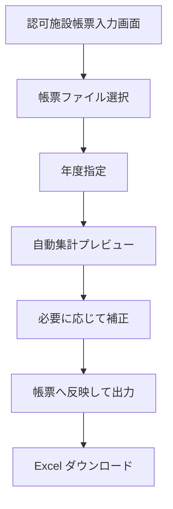

# 認可施設帳票入力画面仕様

## 目的

`ninka_input.xlsx` 形式の認可施設帳票へ、open-hoikuict に登録された情報を転記できるようにする。

初期段階では、既存データから確実に算出できる項目を画面で確認・補正し、帳票へ反映した Excel を出力する。将来的には、法人情報、施設情報、運営情報などを専用マスタとして管理し、帳票の複数シートへ連携できるようにする。

## 前提

- 対象ファイルは `.xlsx` とする。
- 元の帳票ファイルは上書きしない。
- 出力時はアップロードされた帳票ファイルの書式、シート構成、入力規則、保護設定をできるだけ維持する。
- 初期実装では、マクロ付きファイル、複数年度の同時出力、自治体ごとの帳票差分吸収は対象外とする。
- 個人名簿を帳票へ直接展開する機能ではなく、施設単位の集計値・基本情報を反映する機能とする。

## 画面名

管理画面内の「インポート・エクスポート」に、認可施設帳票入力連携エリアを設ける。

将来的に入力項目が増えた場合は、独立した画面として以下を追加する。

```text
/data-transfers/ninka/
```

画面表示名は「認可施設帳票入力」とする。

## 初期画面構成

### 1. 帳票ファイル

| 項目 | 内容 |
| --- | --- |
| 認可施設帳票 | `.xlsx` ファイルをアップロードする |
| 年度 | 反映対象年度。初期値は現在日付から見た保育年度 |

年度は 4 月始まりで判定する。

| 現在日付 | 初期年度 |
| --- | --- |
| 2026-04-01 から 2027-03-31 | 2026 |
| 2027-04-01 から 2028-03-31 | 2027 |

### 2. シート4 集計プレビュー

帳票出力前に、以下の集計値を表示する。

| 年齢 | 利用定員数 | 利用者数 | 学級数 |
| --- | ---: | ---: | ---: |
| 0歳 | 自動入力 | 自動集計 | 自動集計 |
| 1歳 | 自動入力 | 自動集計 | 自動集計 |
| 2歳 | 自動入力 | 自動集計 | 自動集計 |
| 3歳 | 自動入力 | 自動集計 | 自動集計 |
| 4歳 | 自動入力 | 自動集計 | 自動集計 |
| 5歳 | 自動入力 | 自動集計 | 自動集計 |
| 合計 | 自動集計 | 自動集計 | 自動集計 |

初期実装では、利用定員数は利用者数と同じ値を初期値として表示する。実際の定員と異なる園では、画面上で補正できるようにする。

### 3. 補正入力

各年齢行について、以下を手入力で上書きできる。

| 項目 | 入力形式 | 備考 |
| --- | --- | --- |
| 利用定員数 | 0 以上の整数 | 実際の認可定員が利用者数と違う場合に補正 |
| 利用者数 | 0 以上の整数 | 自動集計と異なる提出基準の場合に補正 |
| 学級数 | 0 以上の整数 | クラス構成を提出用に補正 |

補正値は出力時のみ使う。初期実装では、補正値を DB に保存しない。

### 4. 出力

「帳票へ反映して出力」ボタンで、アップロードされた帳票ファイルへ値を反映した `.xlsx` をダウンロードする。

出力ファイル名は以下の形式とする。

```text
hoikuict-ninka-input-{年度}-{YYYYMMDD-HHmm}.xlsx
```

## シート4 反映仕様

対象シートは Excel タブ名 `シート４` とする。内部 XML ファイル名では判定しない。

### 反映セル

| 年齢 | 利用定員数 | 利用者数 | 学級数 |
| --- | --- | --- | --- |
| 0歳 | `H25` | `L25` | `P25` |
| 1歳 | `H27` | `L27` | `P27` |
| 2歳 | `H29` | `L29` | `P29` |
| 3歳 | `H31` | `L31` | `P31` |
| 4歳 | `H33` | `L33` | `P33` |
| 5歳 | `H35` | `L35` | `P35` |
| 合計 | `H37` | `L37` | `P37` |

### 自動集計ルール

利用者数は、対象年度の 4 月 1 日時点の年齢で集計する。

対象園児は以下を満たすものとする。

- `status` が `enrolled`
- 入園日が出力基準日以前
- 退園日が空、または出力基準日より後

学級数は、対象年齢の園児が所属するクラス ID の重複を除いて数える。

合計は 0〜5歳の合算とする。

## 施設情報シート反映仕様

対象シートは Excel タブ名 `施設情報` とする。

| 項目 | セル | 内容 |
| --- | --- | --- |
| 更新日時 | `C2` | 出力実行日時 |
| 年度 | `D2` | 画面で指定した年度 |

## 入力値の保存方針

### 初期実装

補正値は保存しない。帳票出力のたびに画面上で確認・補正する。

### 第2段階

年度ごとの帳票入力値を保存する。

想定する保存単位は以下。

| 保存単位 | 内容 |
| --- | --- |
| 年度 | `2026` など |
| シート | `シート４` など |
| 項目キー | `age_0_capacity` など |
| 値 | 入力値 |
| 更新者 | 職員名 |
| 更新日時 | 最終更新日時 |

### 第3段階

法人情報、施設情報、運営情報、職員体制などを専用マスタ化する。

## 将来入力項目

### 法人・施設基本情報

主に `シート１`、`シート２` へ反映する。

| 分類 | 項目例 |
| --- | --- |
| 法人情報 | 法人種別、法人名、法人名ふりがな、代表者名、所在地、電話番号 |
| 施設情報 | 施設類型、施設名、施設名ふりがな、所在地、電話番号、設置主体 |
| 管理者情報 | 管理者氏名、職名 |
| 認可情報 | 認可年月日、開始年月日、確認年月日 |

### 運営情報

主に `シート４`、`シート７` へ反映する。

| 分類 | 項目例 |
| --- | --- |
| 開所時間 | 平日、土曜、日祝、延長保育 |
| 運営方法 | 運営方法、保育内容、年間行事 |
| 安全管理 | 事故防止指針、研修、個人情報保護 |
| 評価 | 第三者評価の実施状況、結果 URL |

### 職員体制

主に `シート３` へ反映する。

| 分類 | 項目例 |
| --- | --- |
| 職種別人数 | 保育士、保育従事者、看護師など |
| 常勤・非常勤 | 常勤人数、非常勤人数 |
| 労働時間 | 職種別の平均労働時間 |
| 経験年数 | 常勤・非常勤の平均経験年数 |

初期段階では職員モデルが帳票に必要な粒度を持っていないため、自動集計ではなく手入力マスタとして扱う。

## バリデーション

### ファイルチェック

- `.xlsx` 以外はエラー。
- `シート４` が存在しない場合はエラー。
- `施設情報` が存在しない場合はエラー。
- 対象セルへ書き込めない場合はエラー。

### 入力チェック

- 年度は 2000〜2100 の整数。
- 利用定員数、利用者数、学級数は 0 以上の整数。
- 合計行は自動計算とし、直接編集はできない。
- 補正後の利用者数合計が 0 の場合は警告を表示する。
- 学級数が 0 で利用者数が 1 以上の場合は警告を表示する。

## エラー表示

画面上部にエラーを表示する。

| エラー | 表示例 |
| --- | --- |
| ファイル形式不正 | 認可施設帳票の Excel ファイル（.xlsx）を選択してください。 |
| 必須シートなし | 認可施設帳票の必須シートが見つかりません: シート４ |
| ファイル破損 | Excel ファイルを読み込めません。 |
| 入力値不正 | 利用定員数は 0 以上の整数で入力してください。 |

## 権限

- 出力は編集権限を持つ職員のみ実行できる。
- 閲覧専用職員は画面表示のみ可能とし、出力ボタンは無効化する。
- 将来、年度別入力値を保存する場合は、保存操作も編集権限を必須とする。

## 画面遷移



## 受け入れ条件

- 認可施設帳票 `.xlsx` を選択できる。
- 年度を指定できる。
- `シート４` の 0〜5歳別の利用定員数、利用者数、学級数をプレビューできる。
- プレビュー値を画面上で補正できる。
- 合計行が自動計算される。
- 出力した Excel の `シート４` に補正後の値が反映される。
- 出力した Excel の `施設情報` に年度と更新日時が反映される。
- 元ファイルのシート構成と書式が維持される。
- 必須シートがない場合は、出力せずにエラーを表示する。

## 実装ステップ案

1. 現在の出力フォームに集計プレビューを追加する。
2. 年齢別の補正入力欄を追加する。
3. POST 時に補正値を受け取り、`シート４` の対象セルへ反映する。
4. 入力バリデーションと警告表示を追加する。
5. 年度別入力値の保存テーブルを検討する。
6. 法人・施設基本情報マスタを追加する。
